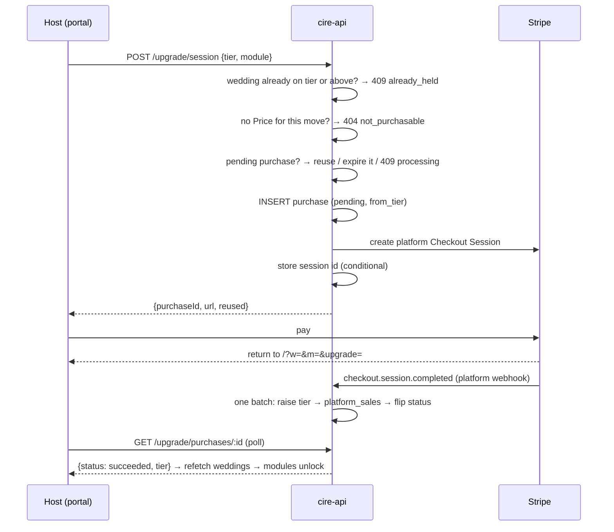

# Self-serve upgrades — buying a plan tier

A wedding's owner presses **Upgrade** on a locked module's nav row, pays on a
Stripe-hosted page, and the wedding moves up a plan tier — every module that
tier includes opens at once. The tiers themselves, and what each one opens,
are [[cire-entitlements]].

Two tiers are sold: **Gold** and **Crimson**. A wedding on Ivory can buy
either; a wedding on Gold can buy Crimson at an upgrade-from-Gold price; a
wedding on Crimson has nothing to buy. The one-off `premium_templates`
entitlement is comp-only.

---

## The one rule everything else follows

**Only a signature-verified webhook raises a wedding's tier.** The browser's
return from Stripe polls; it never asserts. A hand-typed `?upgrade=…`
therefore buys nobody anything.

---

## Two Stripe relationships, deliberately kept apart

This is the fact that shapes the whole design.

|                    | Gifts                              | Upgrades                            |
| ------------------ | ---------------------------------- | ----------------------------------- |
| Merchant of record | The couple                         | **cire**                            |
| Charge type        | Direct, on their connected account | Platform                            |
| Endpoint           | `POST /api/stripe/webhook`         | `POST /api/stripe/platform-webhook` |
| Signing secret     | `STRIPE_WEBHOOK_SECRET`            | `STRIPE_PLATFORM_WEBHOOK_SECRET`    |
| `event.account`    | Always present                     | Must be **absent**                  |

> [!important]
> A Stripe endpoint is scoped either to the platform or to connected accounts, and each carries its own signing secret while a verifier holds exactly one. So an upgrade branch inside the Connect route would be a branch **no event could reach** — unreachable in production and green in every test, because a test signs with whatever secret it is handed. That is why there are two endpoints rather than one route with a branch.

The separate secret is the security boundary; the absent-`account` check is
belt and braces behind it, so a connected account naming itself still grants
nothing.

**Both endpoints are exempt from the CSRF origin guard** by exact path
(`cire/api/src/lib/origin-guard.ts`). Stripe sends no `Origin`, so without the
exemption the guard 403s every delivery before its signature is checked and
Stripe retries the 403 for days.

---

## Flow



---

## Routes

All under `/api/organiser/weddings/:weddingId/upgrade`, in
`cire/api/src/routes/upgrade.ts`.

| Route                | Gate      | Answers |
| -------------------- | --------- | ------- |
| `GET /catalogue`     | member    | `{ tier, upgrades: [{ tier, fromTier, title, blurb, amountMinor, currency }] }` — the wedding's tier and only the tiers above it, each priced for the move from where the wedding is |
| `POST /session`      | **owner** | Body `{ tier: "gold" \| "crimson", module? }` → `{ purchaseId, url, reused }`. 404 `not_purchasable` · 409 `already_held` · 409 `processing` · 502 `payment_provider_unavailable` |
| `GET /purchases/:id` | member    | `{ purchase: { status, tier } }`. Wedding-scoped, so another wedding's id is not found. `tier` is `null` only for a legacy product that names no tier |

Owner-only on the write, matching the Connect onboarding route: it names a
card. `module` is checked against the portal's module list and anything else
lands on `overview`, so a request body can never put an arbitrary string into a
URL Stripe redirects to. Stripe returns the organiser to
`<organiser origin>/?w=<weddingId>&m=<module>&upgrade=<purchaseId>`, and to the
same URL without `upgrade` on cancel.

> [!warning]
> These routes carry **no** tier gate. Gating the route that sells a tier on
> that tier is a 402 loop. The role gates still read the wedding's tier with
> the owner row, and that is what the catalogue prices from, so it costs no
> query of its own. See [[cire-entitlements]].

They are mounted **after** the `AnyElysia` widening in `app.ts`: the organiser
chain is already at TypeScript's instantiation-depth limit (TS2589) and one
more `.use()` there fails the type-check.

---

## Pricing

No money amount is stored in this repository. A catalogue entry names a
**Stripe Price id** supplied per deployment, and the amount is read back from
Stripe. The title and blurb for each tier are product copy that ships with the
release (`COPY` in `cire/api/src/services/upgrade-catalogue.ts`).

| Move | Var |
| --- | --- |
| Ivory → Gold | `STRIPE_UPGRADE_PRICE_GOLD` |
| Ivory → Crimson | `STRIPE_UPGRADE_PRICE_CRIMSON` |
| Gold → Crimson | `STRIPE_UPGRADE_PRICE_CRIMSON_FROM_GOLD` — a second Price on the Crimson product |

The Worker reads them in `cire/api/src/index.ts` (into the catalogue's
`prices: { gold, crimson, crimsonFromGold }`), and the local server in
`cire/api/src/local.ts` from `process.env`. They are ordinary `[vars]` in each
environment of `cire/api/wrangler.toml`, not secrets, and named envs inherit no
vars, so each tier declares its own. They are commented out in every
environment until the Stripe Prices exist: with none set, the catalogue is
empty, every checkout 404s, and the locked rows offer an upgrade nobody can
complete. Test-mode Price ids in dev, live ones in production; a test id in
production fails at checkout.

**Key-optional and fail-closed.** A move with no configured Price is not for
sale: absent from the catalogue, 404 from the checkout route. In particular,
with `STRIPE_UPGRADE_PRICE_CRIMSON_FROM_GOLD` unset a Gold wedding is not
offered Crimson at all — never at the full price again. Absent configuration
never means free, and a blank or whitespace var counts as absent. With no
`STRIPE_SECRET_KEY` the routes are not mounted.

Prices are cached per isolate for ten minutes (`PRICE_CACHE_TTL_MS`) — the
catalogue is read on every upgrade dialog, and each would otherwise spend a
Stripe call against the platform's quota on an answer that has not moved. A
Price Stripe refuses drops only its own entry and is not cached, so fixing it
recovers without a deploy.

---

## The two failures this is built against

### Charging twice for one tier

A webhook can lag — seconds normally, days if the Worker answered 500 and
Stripe is retrying. An organiser who paid, saw nothing unlock and pressed
Upgrade again must not get a second payment page.

A wedding has **at most one pending purchase, whatever it buys**: the partial
unique index `wedding_upgrade_purchases_one_pending_uniq` is on `(wedding_id)
WHERE status = 'pending'`. `startPurchase` reads the wedding's tier and any
pending purchase in one statement, and resolves that purchase **before** it
ever reaches an insert:

| Pending purchase | Action |
| --- | --- |
| Its session is `open`, same tier and same from-tier | Return that URL (`reused: true`) — the double-press fix |
| Its session is `open`, a different product | Expire it at Stripe (`POST /v1/checkout/sessions/{id}/expire`), close the row, insert. A refused expire answers **409 `processing`** — it may have been paid meanwhile |
| Its session is `complete` | **409 `processing`**. Never insert: the money has very likely moved, and the wedding's tier with it |
| Its session is `expired` | Close the row, then insert |
| The probe failed | 409 `processing` — failing to reach Stripe is not evidence a session is dead |
| No session yet, younger than `STALE_PENDING_MS` | 409 `processing` — another request's Stripe call is in flight |
| No session yet, older | Close it as `failed`, then insert |

So a Crimson click is never handed a Gold payment page, and two pages for the
same wedding can never both be paid.

`retrievePlatformCheckoutSession` returns a **state** rather than the nullable
URL the gift reader returns, because here `complete` and `expired` need
opposite answers.

The index is the backstop behind all of this, never the control flow. The
insert goes through `Effect.tryPromise`, and `upgradeConflictReason` turns a
violation naming `wedding_upgrade_purchases.wedding_id` into the 409
`processing` (SQLite names the columns a conflict was on, never the index);
`dbQuery` alone would make it a defect, a 500.

### Taking money and granting nothing

Settle reads the purchase row, then commits everything else in **one D1
batch**, atomic and in statement order:

**verify → paid? → product → tier → [raise tier → `platform_sales` → flip status]**

> [!important]
> The invariant matters more than the order: **nothing may short-circuit on "this row already reads succeeded"**. Every delivery for a paid session re-runs the grant and the sales insert, both idempotent — the grant only ever raises the tier, and the sales row is keyed on the purchase. A test pins this, and it fails the moment an early return on a replayed delivery is added.

**The product maps to a tier** (`tierForProduct` in
`cire/api/src/services/upgrades.ts`), and rows written before tiers settle into
what their money now buys:

| Stored product | Tier granted |
| --- | --- |
| `gold`, `registry`, `capacity_500` | Gold |
| `crimson`, `vendors`, `capacity_1000` | Crimson |
| anything else | none — a **defect** |

A paid purchase whose product names no tier is answered 500, so Stripe keeps
retrying while someone looks, with an error log (`upgrade settle unmappable
product`) and the `defect` outcome on the settle counter. A 2xx would end the
only record that money arrived for nothing.

The status flip accepts `pending` **or `expired`** → `succeeded`: a session can
be paid in the moment before it is expired — by the different-product rule
above, or by the tier migration, which expired every pending per-module
purchase — and the money is as real as any other.

A **NULL session id is adoption, not a mismatch**: the row is session-less
between minting a session and storing its id, and the session is payable
throughout. Rejecting it would lock out a customer who paid.

Card-only sessions (`payment_method_types=[card]`) mean none can complete
unpaid, so `async_payment_succeeded` is deliberately not handled. The unpaid
check stays anyway — granting on an unpaid session is the one mistake a retry
cannot undo.

A purchase records `from_tier` (`ivory` or `gold`), which is what tells a
Crimson bought outright from one bought as an upgrade from Gold; the grant
records `tier_source = 'purchase'` and `tier_granted_by = 'stripe:<purchase
id>'` on the wedding.

---

## The portal

`UpgradeDialog` (`cire/host/src/components/UpgradeDialog.tsx`) is mounted
**once** for the whole nav, not once per locked row. It sells the tier the
row's lock names ([[cire-host-portal-layout]]):

- It prices from the cached catalogue (`lib/upgrade-store.ts`), fetched the
  first time a dialog opens.
- The eyebrow reads **Upgrade from Gold** when the entry's `fromTier` is Gold,
  so the smaller figure is not read as Crimson's full price.
- A catalogue `tier` at or above the one on offer reads as already held, and
  offers no button; so does a tier the catalogue does not list ("not available
  on this site yet").
- It posts `{ tier, module }`, so Stripe returns the organiser to the module
  they asked for.
- A `processing` refusal tells the organiser to wait. Inviting a second payment
  there is the client half of the double-charge guard.

The return from Stripe carries its receipt in the **query**, not the fragment
— the portal is hash-routed, so the hash is the route:

```
https://host.cireweddings.com/?w=<weddingId>&m=<module>&upgrade=<purchaseId>
```

`readUpgradeReturn` (`cire/host/src/lib/upgrade-return.ts`) validates it, and
`OrganiserApp` strips those params the moment it reads them: `setRoute`
rebuilds the URL as `pathname + search + hash` on every hash write and the
login bounce carries `search` through, so anything left behind would re-run
the poll on every later navigation. It then polls with a bounded backoff,
drops the cached catalogue, refetches the wedding list — which is what the nav
locks by, so that is what unlocks the modules — and names the tier bought in
its toast.

---

## Retention and compliance

`wedding_upgrade_purchases` (migration 0061) cascades from `weddings.id` like
every other cire table. `platform_sales` deliberately does **not**: no foreign
key, no wedding id, no profile id. cire is the merchant of record for an
upgrade, so the record of money cire took must not die with the wedding row.
Its `entitlement` column holds the product sold (`gold` or `crimson`); the
amount tells a Crimson-from-Gold sale apart, and `from_tier` is on the purchase
row it names.

It is written at **settle**, not at deletion, because no wedding-DELETE flow
exists to trigger one. `purchase_id` is UNIQUE, which is what makes the insert
idempotent across redeliveries.

> [!caution]
> The row is **pseudonymous, not anonymous**. `settled_at` is the same moment the purchase row settles and the tier is raised, and the amount and product repeat the purchase row, so while that row exists the join is exact — and afterwards it stays linkable through Stripe's own retained session. See `wiki/compliance/data-map.md` and `wiki/compliance/retention.md`.

With no wedding-DELETE flow, a purchase row is currently retained
**indefinitely with the wedding shell**. The cascade is designed behaviour,
not current behaviour.

Refunds do not lower a tier on their own; an operator lowers it with
`grant-tier.ts --lower` ([[cire-entitlements]]). The customer-facing wording is
englishstventures/osn#1317.

---

## Local development

Two forwarders, because there are two endpoints:

```bash
stripe listen --forward-connect-to localhost:8787/api/stripe/webhook \
              --forward-to         localhost:8787/api/stripe/platform-webhook
STRIPE_SECRET_KEY=sk_test_… \
STRIPE_WEBHOOK_SECRET=whsec_… STRIPE_PLATFORM_WEBHOOK_SECRET=whsec_… \
STRIPE_UPGRADE_PRICE_GOLD=price_… STRIPE_UPGRADE_PRICE_CRIMSON=price_… \
STRIPE_UPGRADE_PRICE_CRIMSON_FROM_GOLD=price_… \
  bun run --cwd cire/api dev:app
```

One `stripe listen` prints **one** signing secret for everything it forwards,
so locally both secrets carry the same value. Deployed tiers have two dashboard
endpoints and two different secrets — that difference is a deployed property,
and it is what the wrong-secret test pins.

Creating either endpoint and the three Prices in the Stripe dashboard, and
verifying a deployed tier end to end, is [[stripe-webhooks]].

---

## Observability

| Instrument                      | Attributes |
| ------------------------------- | ---------- |
| `cire.upgrade.checkout.started` | `tier` (`gold`/`crimson`), `from_tier` (`ivory`/`gold`/`crimson`), `result` (`ok`/`reused`/`processing`/`already_held`/`unconfigured`/`error`) |
| `cire.upgrade.purchase.settled` | `tier` (`gold`/`crimson`/`unmapped`), `outcome` (`granted`/`replayed`/`unpaid`/`failed`/`expired`/`unknown`/`defect`) |

Spans: `cire.upgrade.catalogue`, `cire.upgrade.startPurchase`,
`cire.upgrade.settlePurchase`, `cire.upgrade.failPurchase`,
`cire.upgrade.purchaseStatus`.

Closed unions only; no wedding, purchase or profile id ever becomes an
attribute. The gap between the two counters is the health signal: money taken
with no tier raised shows as `started` without a matching `settled`. A
sustained rise in `processing` means deliveries are lagging. `unpaid` should
stay at zero while sessions are card-only, and any `defect` is a customer who
paid and holds nothing until someone looks.

---

## Related

- [[cire-entitlements]] — the tiers, the tier gate, and changing a tier by hand
- [[stripe-webhooks]] — creating the two endpoints and the Prices, verifying a tier
- [[cire-host-portal-layout]] — the locked nav row that opens the dialog
- [[cire-registry]], [[cire-vendors]] — modules a tier opens
- [[cire-auth]] — role gate ordering
